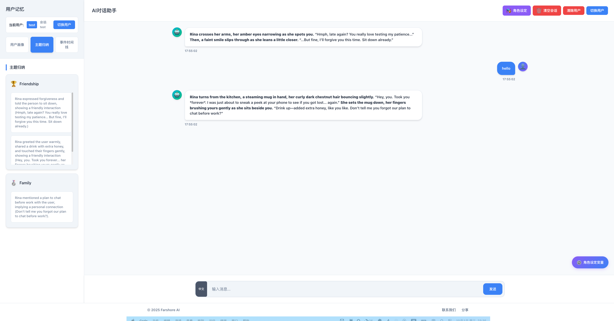

# Remember 后端微服务架构

这是 RememberMe 项目的后端微服务目录，采用高度一致的微服务架构设计。

## 🏗️ 架构设计理念



所有微服务都遵循相同的架构模式，确保代码的一致性和可维护性：

### 统一的微服务结构
每个微服务模块都包含以下核心文件：

- `api.go` - HTTP API 路由和处理函数
- `config.go` - 服务配置和初始化
- `connect.go` - 数据库和外部服务连接
- `db.go` - 数据库操作和查询
- `model.go` - 数据模型定义
- `logger.go` - 日志记录配置
- `utils.go` - 工具函数和辅助方法
- `worker.go` - 后台任务处理（可选）
- `monitor.go` - 监控和健康检查（可选）

## 📁 微服务模块

### 主服务 (端口 6006)
**server/** - 核心对话协调服务
- 处理所有客户端请求
- 协调其他微服务
- 提供主要的记忆管理API

### 会话服务 (端口 9120)
**session_messages/** - 对话历史管理
- 存储和检索会话消息
- 维护对话上下文
- 消息历史查询

### 用户画像服务 (端口 9121)
**user_poritrait/** - 用户画像分析
- 构建用户偏好画像
- 分析用户行为模式
- 个性化推荐

### 话题摘要服务 (端口 9122)
**topic_summary/** - 话题提取和总结
- 识别对话中的关键话题
- 生成话题摘要
- 话题趋势分析

### 聊天事件服务 (端口 9123)
**chat_event/** - 事件记录和管理
- 记录重要聊天事件
- 事件时间线管理
- 任务跟踪

### OpenAI服务 (端口 8344)
**openai/** - LLM集成服务
- OpenAI/BytePlus API封装
- 流式响应处理
- 模型调用管理

## 🔄 微服务通信模式

### 请求流程
1. 客户端 → 主服务 (6006)
2. 主服务 → 各专业微服务
3. 微服务 → 数据库/外部API
4. 返回处理结果

### 数据流
- Redis: 缓存和消息队列
- MongoDB: 持久化数据存储
- 共享配置: 通过config/目录统一管理

## 📊 配置文件结构

### config.yaml 主要配置项
```yaml
server:
  main: 6006           # 主服务端口
  session_messages: 9120
  user_poritrait: 9121
  topic_summary: 9122
  chat_event: 9123
  openai: 8344

redis:
  host: localhost
  port: 6379
  db: 2

mongodb:
  uri: "mongodb://localhost:27017/"
  db: "remember"

llm:
  ServiceProvider: "byteplus"  # 或 "openai"
  api_key: "YOUR_API_KEY"
```

## 🚀 快速开始

### 构建所有服务
```bash
# 构建所有微服务
go build -o server_main server_main.go
go build -o messages_main messages_main.go
go build -o user_main user_main.go
go build -o topic_main topic_main.go
go build -o event_main event_main.go
go build -o openai_main openai_main.go
```

### 启动服务
```bash
# 使用服务管理脚本
./service.sh start all

# 或手动启动
./server_main &      # 主服务
./messages_main &    # 会话服务
./user_main &        # 用户画像服务
./topic_main &       # 话题摘要服务
./event_main &       # 聊天事件服务
./openai_main &      # OpenAI服务
```

## 🔧 开发指南

### 添加新微服务
1. 创建新的模块目录
2. 按照标准结构创建文件
3. 添加主入口文件 (xxx_main.go)
4. 在config.yaml中添加端口配置
5. 更新服务管理脚本

### 代码复用模式
- 每个模块独立但结构一致
- 配置通过config/目录共享
- 工具函数在各模块中独立实现
- 数据库连接模式统一

## 📈 监控和日志

### 日志文件
- `../logs/main.log` - 主服务日志
- `../logs/session_messages.log` - 会话服务日志
- `../logs/user_portrait.log` - 用户画像日志
- `../logs/topic_summary.log` - 话题摘要日志
- `../logs/chat_event.log` - 聊天事件日志

### 健康检查
每个服务都提供健康检查端点：
- `GET /health` - 服务状态检查

## 🔗 相关文档

- [主项目 README](../README.md)
- [API 文档](../API_DOCUMENTATION.md)
- [前端项目 README](../remember-web/README.md)
- [服务管理脚本](../service.sh)

## 💡 架构优势

1. **一致性**: 所有微服务遵循相同模式
2. **可维护性**: 模块化设计，易于理解和修改
3. **可扩展性**: 轻松添加新的微服务
4. **独立性**: 每个服务可以独立部署和扩展
5. **容错性**: 单个服务故障不影响整体系统
